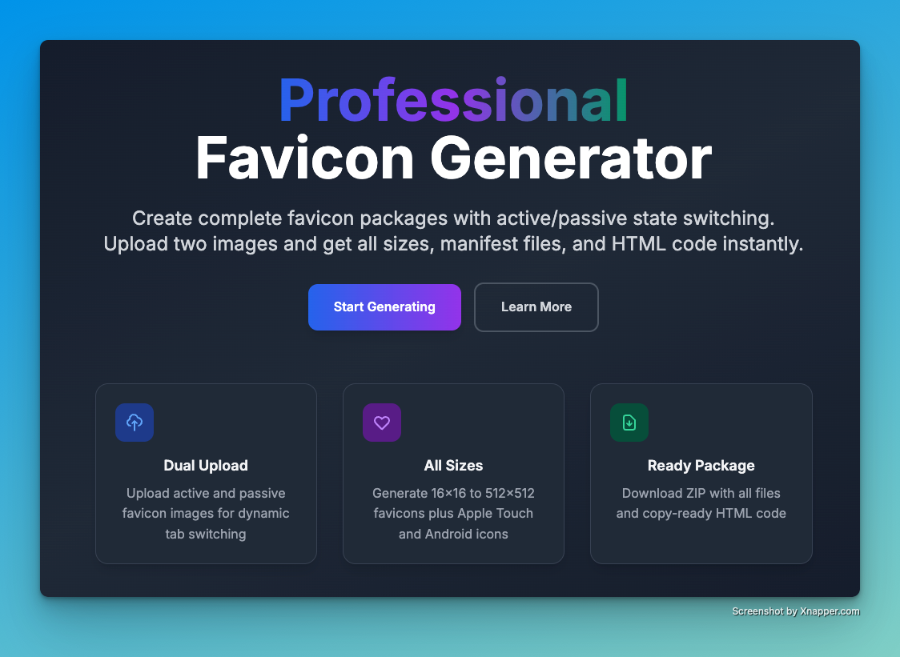
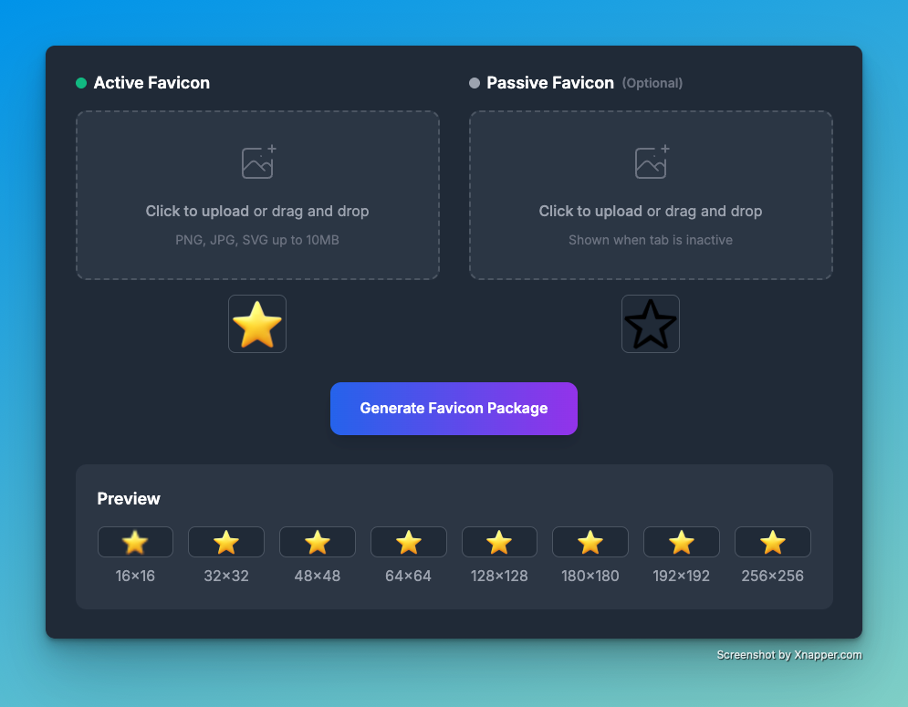

# AddFavicon.com - Professional Favicon Generator



A modern, minimalistic favicon generator that creates complete favicon packages with unique active/passive state switching capabilities.

## 🚀 Features

### Core Functionality
- **Dual Image Upload**: Upload separate images for active and passive favicon states
- **Complete Size Generation**: Generates all standard favicon sizes (16×16 to 512×512)
- **Apple & Android Icons**: Includes Apple Touch icons and Android app icons
- **Dynamic Switching**: JavaScript code for tab activity-based favicon switching
- **ZIP Package Download**: Complete package with all files and manifest
- **Ready-to-Use Code**: Copy-paste HTML snippets with implementation instructions

### Technical Features
- **Client-Side Processing**: All image processing happens in the browser for privacy
- **High-Quality Rendering**: Advanced canvas rendering with smooth scaling
- **Instant Generation**: No server processing or waiting times
- **Cross-Browser Support**: Works with all modern browsers
- **Responsive Design**: Optimized for desktop, tablet, and mobile devices
- **Dark/Light Mode**: Automatic theme switching with user preference detection

## 🛠️ Tech Stack

- **Framework**: [Astro](https://astro.build/) - Modern static site generator
- **Styling**: [TailwindCSS](https://tailwindcss.com/) - Utility-first CSS framework
- **Image Processing**: HTML5 Canvas API for client-side image manipulation
- **Package Creation**: JSZip for creating downloadable ZIP archives
- **Icons**: Heroicons for consistent iconography
- **Fonts**: Inter font family for modern typography

## 📁 Project Structure

```
/
├── public/
│   ├── scripts/
│   │   └── favicon-generator.js    # Main favicon generation logic
│   ├── favicon.svg                 # Site favicon
│   ├── site.webmanifest           # PWA manifest
│   ├── robots.txt                 # SEO robots file
│   └── og-image.jpg               # Open Graph image
├── src/
│   ├── components/
│   │   ├── Header.astro           # Navigation header with theme toggle
│   │   ├── Hero.astro             # Landing hero section
│   │   ├── FaviconGenerator.astro # Main generator interface
│   │   ├── Features.astro         # Features showcase
│   │   ├── FAQ.astro              # Frequently asked questions
│   │   └── Footer.astro           # Site footer
│   ├── layouts/
│   │   └── Layout.astro           # Base layout with SEO meta tags
│   └── pages/
│       ├── index.astro            # Homepage
│       └── sitemap.xml.ts         # XML sitemap generation
├── tailwind.config.mjs            # TailwindCSS configuration
├── postcss.config.cjs             # PostCSS configuration
└── astro.config.mjs               # Astro configuration
```

## 🎨 Design System

### Color Palette
- **Primary**: Blue (#3B82F6) - Trust and professionalism
- **Secondary**: Purple (#8B5CF6) - Creativity and innovation
- **Accent**: Green (#10B981) - Success and completion
- **Neutrals**: Gray scale for text and backgrounds

### Typography
- **Font Family**: Inter - Modern, readable sans-serif
- **Weights**: 300 (Light), 400 (Regular), 500 (Medium), 600 (Semibold), 700 (Bold)
- **Line Heights**: 150% for body text, 120% for headings

### Spacing System
- **Base Unit**: 8px grid system
- **Consistent Spacing**: All margins and padding use multiples of 8px

## 🔧 Development

### Prerequisites
- Node.js 18+
- npm or yarn package manager

### Installation
```bash
# Clone the repository
git clone https://github.com/temaprint/addfavicon.com
cd addfavicon

# Install dependencies
npm install

# Start development server
npm run dev
```

### Available Scripts
```bash
npm run dev      # Start development server at localhost:4321
npm run build    # Build for production
npm run preview  # Preview production build locally
npm run astro    # Run Astro CLI commands
```

### Development Server
The development server runs on `http://localhost:4321` with:
- Hot module replacement for instant updates
- Automatic browser refresh on file changes
- TypeScript support out of the box

## 📱 Browser Support

### Favicon Generation
- Chrome 16+
- Firefox 4+
- Safari 5+
- Edge 12+
- iOS Safari 4+
- Android Browser 4+

### Dynamic Switching Feature
- Chrome 14+
- Firefox 10+
- Safari 7+
- Edge 12+
- iOS Safari 7+
- Android Browser 4.4+

## 🔒 Privacy & Security

### Client-Side Processing
- All image processing happens in the user's browser
- No images are uploaded to servers
- No personal data collection
- No tracking or analytics cookies

### File Handling
- Maximum file size: 10MB per image
- Supported formats: PNG, JPG, JPEG, SVG, WebP
- Automatic format validation and error handling

## 📊 SEO Optimization

### Meta Tags
- Complete Open Graph implementation
- Twitter Card optimization
- Mobile-specific meta tags
- Canonical URL structure

### Structured Data
- JSON-LD WebApplication schema
- Feature list markup
- Organization information

### Performance
- Optimized images and assets
- CSS minification with Lightning CSS
- Font preloading and optimization
- Compressed HTML output

## 🚀 Deployment

### Build Process
```bash
npm run build
```

### Static Output
The build generates static files in the `dist/` directory that can be deployed to any static hosting provider:
- Netlify
- Vercel
- GitHub Pages
- AWS S3
- Cloudflare Pages

### Environment Variables
No environment variables required - the application runs entirely client-side.

## 🤝 Contributing

### Code Style
- Follow existing code formatting
- Use TypeScript for type safety
- Maintain component modularity
- Follow Astro best practices

### File Organization
- Keep components under 200 lines
- Use clear, descriptive file names
- Maintain separation of concerns
- Follow the established directory structure

## 📄 License

This project is open source and available under the [MIT License](LICENSE).

## 🆘 Support

For questions, issues, or feature requests:
- Open an issue on GitHub
- Check the FAQ section on the website
- Review the documentation

## 🔮 Future Enhancements

### Planned Features
- SVG favicon optimization
- Animated favicon support
- Bulk favicon generation
- Custom manifest.json editor
- Favicon testing tools
- Integration with popular CMS platforms

### Performance Improvements
- WebAssembly image processing
- Progressive Web App features
- Offline functionality
- Advanced caching strategies

---

Built with ❤️ using Astro and TailwindCSS